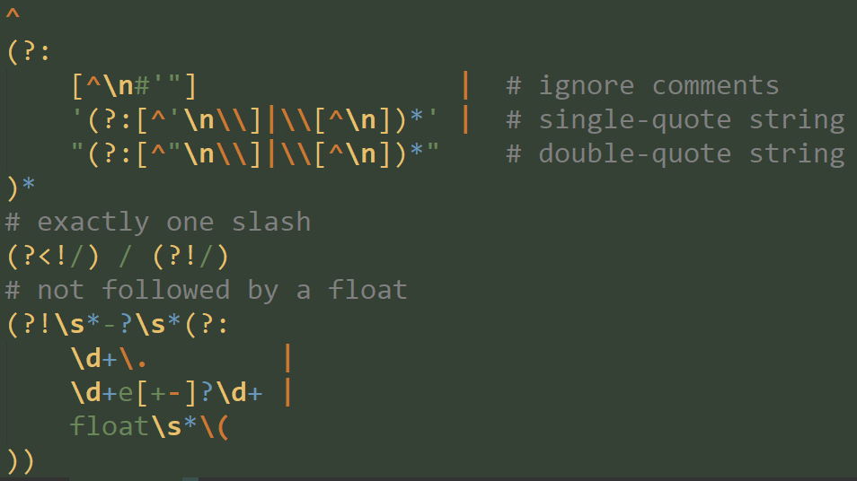

# 2to3
## Converting a Large Web App to Python 3

<div style="text-align:center">
PyWeb-IL #77 &mdash; Sept. 3<sup>rd</sup>, 2018
</div>

<div style="text-align:center">
Tal Einat
</div>

Notes:
- This contains many examples
- Done as a consultant

---

## Background

<div style="text-align:center">
 <!-- .element height="35%" width="35%" -->
</div>

VVV

## Background: Overview

- Late 2017
- Large webapp
    - Single monolithic codebase
    - 100% Python (Django) backend
    - ~600k Python LoC
- Python 2.7
- Used only by few tens of internal employees, all in the US

Notes:

- Developed by an Israeli start-up purchased by client company

VVV

## Background: Project

- Team of 5 engineers working on codebase
    - Continued working while I worked on the upgrade
- Extensive QA testing to be done before rollout
- Minor regressions after rollout are acceptable

Notes:

- This means merges! 
- Previous successful system-wide upgrade: Django 1.6 -> 1.11

VVV

## Background: Technical

- Poor test coverage
    - Mostly integration tests at various levels
    - Lots of utils, mostly untested
- 79 dependencies in requirements.txt
    - ... plus a few forked and vendored deps
- Lots of funky str/unicode handling, including many untested utilities

---

## Python 3

This new major version includes various non-backwards-compatible changes.

- Fix lots of language design mistakes
- 2.7 includes many backported 3.x features
- 2.x → 2.7 → 3.x
    - ~~2.8~~ will never be

Notes:

- "Hindsight is 20/20"
- 2.7 is intended as a stepping stone from 2.x to 3.x
- More on string types later

VVV

## Python 3: Major Changes

- A major reworking of the string types
    - No more str/unicode confusion
- Iterators rather than lists
    - Examples: `range()`, `map()`, `filter()`, `dict.keys()`
- `print` is a function rather than a statement
- Dividing integers returns a float: `3 / 2` → `1.5`
    - separate "floor" division operator `//`
- Some reorganization of the stdlib, e.g. urllib/urllib2

Notes:

- This is mostly to get a feel for what's changed
- `dict.keys()` actually gives a special view object

VVV

## Python 3: A Rocky Start

- 3.0 release → Community slow to adopt
- Some questioned whether 3.x would ever catch on
- Up to 3.3, 3.x development was focused on easing the transition from 2.x

VVV

### Diffusion of Innovations

<div style="text-align:center">
 <!-- .element height="75%" width="75%" -->
</div>

Notes:

- 3.0 release is at the left edge of the graph
- by late 2017, somewhere in the middle

VVV

## Python 3 Takes Over

By late 2017 Python 3 was well-established:

- Most major libraries supported Python 3
- Adoption was high
    - Perhaps finally overcoming 2.x
- Versions 3.4-3.6 introduced many great new features not found in 2.7.
    - Practical incentive to use 3.x

We didn't yet know, but in early 2018 Python 2's end-of-life at 2020
was announced.

Notes:

New in 3.x not available in 2.7 (incl. backport libs):

- asnycio and `async`/`await` (and `yield from`)
- f-strings
- matrix multiplication operator: `@`
- unpacking generalizations
    - `{**a, **b}`
    - `a, b, *rest = iterable`
- underscores in numeric literals
- pickle protocol 4

---

## Python 2 to Python 3: six?

Many libraries support 2.x and 3.x, usually using the "six" library,
such as Django.

Less practical for web-apps:

- Apps can usually specify a version of Python
- Incurs a "tax" on coding, style and readability
    - esp. for dict-heavy code
- No automated tools convert from 2.x to six

Notes:

- 6 = 2 × 3; get it?
- Highly recommended for Python libs

VVV

## 2to3

- Refactoring tool created by the Python devs
- Intention: keep 2.x code, use 2to3 for 3.x releases
- 2to3 couldn't handle the "very long tail" of real edge cases
- Not well received, hardly used, fell into obscurity

Notes:

The Python devs (incl. Guide) spent great effort creating "2to3", a refactoring
tool for automatically converting Python 2 code to Python 3.

The intention was that devs would initially continue to maintain a 2.x codebase,
and use 2to3 to release 3.x versions.  Unfortunately, 2to3 could not address
the many edge-cases and minor inconsistencies found in practice, making the
intended use impractical.

2to3 was not well received and fell into obscurity.

VVV

## My Approach: 2to3!

- 2to3 was exactly what I needed!
- Covered the great majority of required changes
- Worked very well
- 2to3 is **extensible!**

Notes:

- Surprise! (not)
- Obscure but not neglected
- I reviewed other, similar tools and found that they added nothing relevant.
- By writing custom "fixers" or changing existing ones, I could use 2to3
    to address additional cases not supported out of the box.

---

## 2to3: Fixers

- Total 52 fixers
- 4 are optional (weren't relevant for this project)
- Not idempotent, i.e. can't run a fixer twice
    - This means after applying a fixer and merging other changes,
        additional fixes of the same kind must be made manually.

Notes:

- I spent *days* on manual fixes after merging.

---

## 2to3: Divide and Conquer

- Default mode: run on a whole project, applying all fixers.
- Resulted in one *huge* diff.  No good for me: 
    - I wanted to manually review the changes.
    - I wanted to apply changes incrementally.

Notes:

- I wanted the result nice & readable, not just correct.

VVV

## 2to3: Divide and Conquer (cont.)

Possible MO: Upgrade each module/package individually.

- Some very large modules (~10k LoC)
    - So still huge diffs
- Mixes many different types of changes
    - Lots of mental context switching
    
VVV

## 2to3: Divide and Conquer (cont. #2)

Alternative MO: Apply each "fixer" separately.

- Avoid excessive mental context switching
- Allows cataloguing fixer-specific issues
- Allows tweaking an re-running fixers
- Allows making codebase-wide manual tweaks
    - Lots of regexp search/replace
- Non-default way to use 2to3; not documented.

---

## 2to3: Incremental Application

- Fixers have inter-dependencies
- Need to be run in a certain order

```python
# lib2to3/fixer_base.py
class BaseFix(object):
    run_order = 5   # Fixers will be sorted by
                    # run order before execution.
                    # Lower numbers will be run first.

    order = "post"  # Does the fixer prefer pre-
                    # or post-order traversal
```

Notes:
- pre/post order turned out to be irrelevant
- I read lib2to3 code for listing and loading fixers
- I only did this once to create a properly sorted list

VVV

## 2to3: Fixer Example

```python
# lib2to3/fixes/fix_isinstance.py
"""Fixer that cleans up a tuple argument to isinstance after
the tokens in it were fixed.  This is mainly used to remove
double occurrences of tokens as a leftover of the
long -> int / unicode -> str conversion.

eg.  isinstance(x, (int, long)) → isinstance(x, (int, int))
       -> isinstance(x, int)
"""

class FixIsinstance(fixer_base.BaseFix):

    run_order = 6
```

Notes:
- This example shows why order matters
- Default `run_order` is 5

---

## Process Overview

1. Apply 2to3 fixers one at a time
2. Apply manual fixes one at a time
3. Rework relevant utilities
4. Update dependencies
5. Testing
6. QA
7. Wait for deployment window
8. Deploy

Notes:

- 1-4 are the actual conversion
- each change included manual review and tweaking
- manual fixes examples (more on this later):
    1. String handling
    2. Integer division
    3. Moved modules/functions
- I wrote unit tests for some utils before converting them

VVV

## Merge Merge Merge

1. Convert to Python 3
2. _Merge_
3. Test
4. _Merge_
5. QA
6. Wait for deployment window
7. _Merge_
8. Deploy

---

## Manual Tweak Example: list()

- Many fixers for things that now return iterators, e.g. map(), dict.keys()
- These are wrapped with `list(...)`
- ... except in special cases:
    - `for X in map(...):`
    - `sorted(map(...))`
- Special cases sometimes missed
- `filter(foo, map(...))` missed
- Result: Lots of manual tweaking

Notes:

- In hindsight, manual tweaking here was possibly a mistake

---

## Manual Fixes

- String handling
- Integer Division
- Moves not handled by 2to3
    - base64
    - operator.div → operator.truediv
    - mock → unittest.mock
    - simplejson → json
- `open()` and `file()`
- More strict comparisons of different types
    - e.g. '1' > 0 now raises TypeError
- Existing uses of `six`

VVV

## Manual Fix Example: Base 64

- This no longer works: `'aaa'.encode('base64')`
- Converting to bytes doesn't help: `b'aaa'.encode('base64')`
- Reasons:
    1. 'base64' is a bytes → bytes encoding
    2. bytes doesn't have an 'encode()' method
- Solution: Use the `codecs` or `base64` modules
    - `base64.b64encode(b'aaa')  # no newlines`
    - `codecs.encode(b'aaa', 'base64')  # with newlines`

---

## Manual Fix Example: Integer Division

- The division operator (`/`) now does true division on ints.
- No 2to3 fixer for this!
    - impossible to automate all cases
    - but why not simple cases?
    - `3 / 2`

Notes:

- This is a glaring omission IMO
- A few more esoteric changes also have no fixers

VVV

## Manual Fix Example: Integer Division

I regex searched through the codebase with this:

```python
re.compile(r'''
    ^
    (?:
        [^\n#'"]                |  # ignore comments
        '(?:[^'\n\\]|\\[^\n])*' |  # single-quote string
        "(?:[^"\n\\]|\\[^\n])*"    # double-quote string
    )*
    # exactly one slash
    (?<!/) / (?!/)
    # not followed by a float
    (?!\s*\-?\s*(?:
        \d+\.        |
        \d+e[+-]?\d+ |
        float\s*\(
    ))
''', re.VERBOSE)
```

Notes:

- find in all files → tweak regexp → repeat
    - until few enough results (just over 100)
- actually fixed ~10 cases that would have been broken
- https://regex101.com/r/9ZCcH7/1

VVV

## Manual Fix Example: Integer Division



- find in all files → tweak regexp → repeat
    - until few enough results (just over 100)
- actually fixed ~10 cases that would have been broken
- https://regex101.com/r/9ZCcH7/1

---

## These Things are a PITA to Convert

- CSV-related code, esp. if can include non-ASCII text
- `open()`
- Unicode-related hacks
    - `a.encode('utf-8').decode('latin-1')`
    - Functions accepting both str and unicode
- Base64
    - `base64.b64encode(("%s:%s" % (a, b)).encode('ascii')).decode('ascii')`

Notes:

- CSV is a surprisingly horrible format.

---

## Dependencies

I went through the ~80 deps one by one:

- ~50% already supported Python 3
- ~50% just needed to be upgraded
- of the few left:
    - some dropped
    - some had drop-in replacements
    - one I forked and upgraded

End result: a single "update dependencies" commit.

VVV

## Dependencies
### Dropped due to inclusion in stdlib

1. enum34
2. funcsigs (required by mock)
3. futures
4. mock
5. simplejson
    - required refactoring imports: `simplejson` → `json`
6. wsgiref

---

## Conclusion: Results

- The rollout to production was very smooth
- Just a few minor issues came up over the next few weeks
- Dev. team excited to use new Python 3 features
- Led the way for other teams still mostly on Python 2
- A short time later, Python 2 end-of-life announced for 2020

---

## Hindsight: Smarter Merges

- Fixers aren't idempotent. After the initial conversion, I had to
  manually search for issues and fix them.
- ~5 iterations of merge + test = **lot** of time
- How to improve?
    - More automation
        - Tweak existing fixers
        - Write new fixers
    - Rebase manual changes
    - List specific issues found with search expressions to find similar ones.

VVV

## Hindsight: Things I Would Implement as Fixers

- fixing `simplejson` imports to `json`
- fixing base64 encoding
- fixing calls to `open()` and `file()`
- 6to3
- more esoteric moves, e.g. `string.letters` → `string.ascii_letters`

---

<!-- .element: class="auto-fragment" -->

## Final Remarks

- I found this project more interesting than expected
- In my research, I found surprisingly little recent info on such conversions
  done by others
- Hire me!

---

# Questions?
